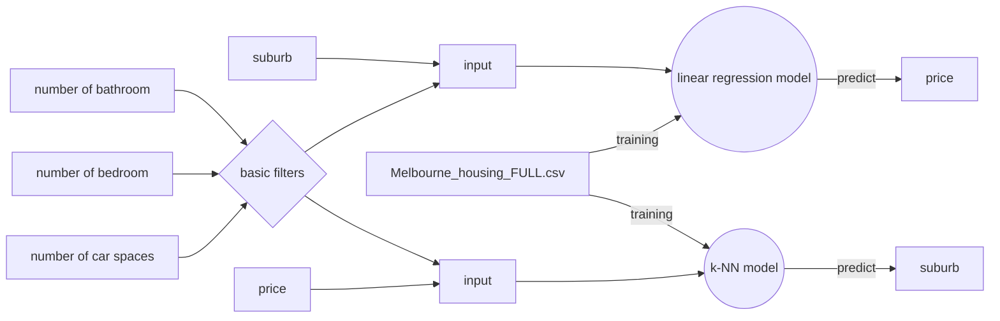

# Property Price Prediction System
Basically, we want to provide a data service for home buyers to predict the **selling price** or potential move in **suburb** which will be determined by the **number of rooms**, **number of bathrooms** and **number of car spaces**

We will use the [`Melbourne_housing_FULL.csv`](https://www.kaggle.com/anthonypino/melbourne-housing-market#Melbourne_housing_FULL.csv) as our data source to train a linear regression model for price prediction and a k-NN model for suburbs that a buyer can afford with the requirement of the property given.

We accept 2 kinds of input to provide different prediction:

1. `number of bathroom`, `number of bedroom`, `car spaces`, `type` and **`suburb`**

    The prediction result will be the `price` of the given conditions.

2. `number of bathroom`, `number of bedroom`, `car spaces`, `type` and **`price`**

    The prediction result will be the `suburb` which could fit the given conditions.

## *Advanced funtions (optinal)*
- Heat map of the number of transaction happening in all suburbs

## API
We use Flask to build RESTful API.
### Authentication
We need authentication in every API. Specifically, we have a pair in backend:
```
    "api_key": "your api key",
    "api_secret": "your api secret",
```
for every API request, the `api_key` field should be added into `Header`. The backend will check the match.
### Response Format
All in all, the uniform style of our RESTful API response is like:
```json
{
    "code": 200,
    "msg": "Successful Login",
    "data": {
            ...
    }
}
```
and
```json
{
    "code": 400,
    "msg": "Wrong password"
}
```
- **code** the code specifies this response, especially for error response
- **msg** the msg could be displayed to user
- **data** the response payload, **ONLY** appears in success response

### APIs
```http
GET /basicfilters
```
This API returns some basic filters information, as the maximum value of `number of bathroom`, `number of bedroom`, `car spaces` and the enum of `type` in the data source.

##### Success response:
```json
{
    "code": 200,
    "msg": "basic filters",
    "data": {
        "max_bedroom": 31,
        "max_bathroom": 5,
        "max_carspace": 3,
        "types" : [
            "house",
            "unit"
        ]
    }
}
```
---
```http
GET /suburbs
```
This API returns all the suburbs with their postcodes. The key is the id of this suburb. Frontend will do the auto complete and suggest thing.

##### Success response:
```json
{
    "code": 200,
    "msg": "suburbs and postcodes",
    "data": {
        "1": {
            "suburb": "Abbotsford",
            "postcode": "3067"
        },
        "2": {
            "suburb": "Airport West",
            "postcode": "3042"
        },
        ...
    }
}
```
---
```http
GET /maxprice
```
This API returns maximum value of `price`.

##### Success response:
```json
{
    "code": 200,
    "msg": "max price",
    "data": {
        "max_price": 999999
    }
}
```
---
```http
GET /predictPrice?bedroom={int}&bathroom={int}&carpark={int}&type={string}&suburb={string}
```
The prediction API
##### parameters
- **bedroom** the number of bedroom user selects
- **bathroom** the number of bathroom
- **carpark** the number of car space
- **type** the type of houses. It can be a list, divided by `,`
- ***suburb** optinal* suburb id. It is mutual exclusive with `price`

##### Possible error code and msg:
These errors depend on our model can or cannot handle the input value not in our database
- **400** basic filters param missing

##### Success response:
```json
{
    "code": 200,
    "msg": "Predicted suburb successfully",
    "data": {
        "prediction": {
            "main": {
              "room": 2,
              "bath": 2,
              "suburb": "Balwyn",
              "price": 1062666.489160954
            },
            "recommendation": [
                {
                    "room": 2,
                    "bath": 2,
                    "suburb": "Alphington",
                    "price": 1078787.2748451298
                  },
                  ....
            ]
         },
         
         "restaurant": [
            {
              "name": "Narai Thai Restaurant Balwyn",
              "location": {
                "lat": -37.8131972,
                "lng": 145.0834349
              },
              "photo": "https://....",
              "rating": 4.5,
              "vicinity": "296 Whitehorse Road, Balwyn"
            },
            .....
         ],
         
         
         "hospital": [
            ... "same as restaurant object, just no rating field"
         ],
         
         
         "school": [
            ... "exactly same as restaurant object"
         ],
         
         
         "supermarket": [
            ... "exactly same as restaurant object"
         ]
         
    }
}


## [Workflow](https://mermaidjs.github.io/mermaid-live-editor/#/view/eyJjb2RlIjoiZ3JhcGggTFI7XG4gICAgMDAtLT58dHJhaW5pbmd8MDIoKGstTk4gbW9kZWwpKVxuICAgIDEwe2Jhc2ljIGZpbHRlcnN9XG4gICAgMTFbbnVtYmVyIG9mIGJhdGhyb29tXS0tPjEwXG4gICAgMTJbbnVtYmVyIG9mIGJlZHJvb21dLS0-MTBcbiAgICAxM1tudW1iZXIgb2YgY2FyIHNwYWNlc10tLT4xMFxuICAgIDE0W3N1YnVyYl0tLT4xNVtpbnB1dF1cbiAgICAxMC0tPjE1XG4gICAgMTAtLT4xN1tpbnB1dF1cbiAgICAxNltwcmljZV0tLT4xN1xuICAgIDE1LS0-MDFcbiAgICAwMFtNZWxib3VybmVfaG91c2luZ19GVUxMLmNzdl0tLT58dHJhaW5pbmd8MDEoKGxpbmVhciByZWdyZXNzaW9uIG1vZGVsKSlcbiAgICAwMS0tPnxwcmVkaWN0fDIwW3ByaWNlXVxuICAgIDE3LS0-MDJcbiAgICAwMi0tPnxwcmVkaWN0fDIxW3N1YnVyYl0iLCJtZXJtYWlkIjp7InRoZW1lIjoiZGVmYXVsdCJ9fQ)
👆 click it

