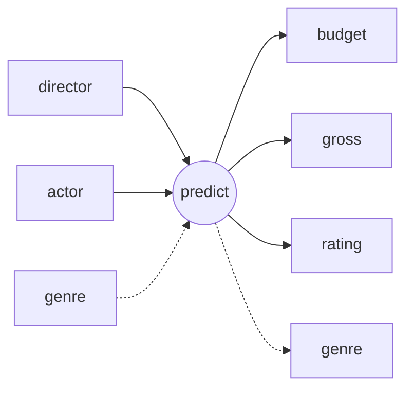

# Moive Prediction System
Basically, we want to provide a data service for investors to predict the **budget**, **gross** etc of a movie which would be directed by the input **director** and acted by the input **actors**.

We use the `movie_metadata.csv` as data source to train a linear regression model.

We accept 2 kinds of input to provide different prediction:

1. `director` and `actor(s)`

    We'll predict the `budget` this movie will need, the `gross` this movie will produce and the `genre` this movie could be.

2. `director`, `actor(s)` and `genre`

    We'll predict the `budget` this movie will need, the `gross` this movie will produce.

## *Advanced funtions (optinal)*
- Rank of Most popular

    On terms of `actor`, `director`, `movies` , etc

- Actor recommendation

    We'll recommend actors may fits the input combination

- Modify data source and re-train

    It may need to store the data from cvs into a functional databse like MongoDB or PostgreSQL.

## API
We use Flask to build RESTful API.
### Authentication
We need authentication in every API. Specifically, we have a pair in backend:
```
    "api_key": "your api key",
    "api_secret": "your api secret",
```
for every API request, the `api_key` field should be added into `Header`. The backend will check the match.
### Response Format
All in all, the uniform style of our RESTful API response is like:
```json
{
    "code": 200,
    "msg": "Successful Login",
    "data": {
            ...
    }
}
```
and
```json
{
    "code": 400,
    "msg": "Wrong password"
}
```
- **code** the code specifies this response, especially for error response
- **msg** the msg could be displayed to user
- **data** the response payload, **ONLY** appears in success response

### APIs
```http
GET /actors
```
This API returns all the actors' name. Frontend will do the auto complete and suggest thing.

##### Success response**:
```json
{
    "code": 200,
    "msg": "actor list",
    "data": [
        "Angelina Jolie",
        "Brad Pitt",
        ...
    ]
}
```
---
```http
GET /directors
```
This API returns all the directors' name. Frontend will do the auto complete and suggest thing.

##### Success response:
```json
{
    "code": 200,
    "msg": "director list",
    "data": [
        "James Cameron",
        "Christopher Nolan",
        ...
    ]
}
```
---
```http
GET /genres
```
This API returns all the genres. Frontend will do the auto complete and suggest thing.

##### Success response:
```json
{
    "code": 200,
    "msg": "genres",
    "data": [
        "Action",
        "Adventure",
        "Sci-Fi",
        ...
    ]
}
```
---
```http
GET /predict?director={director}&actor={actor,}&genre={genre|}
```
The prediction API
##### parameters
- **director** the name of the director
- **actor** the name of actors. It can be a list, divided by `,`
- **genre** *opntional* the name actors. It can be a list, divided by `|`

##### Possible error code and msg:
These errors depend on our model can or cannot handle the input value not in our database
- **400** director not found
- **400** actor not found
- **400** genre not found

##### Success response:
```json
{
    "code": 200,
    "msg": "Predicted successfully",
    "data": {
        "budget": 12345,
        "gross": 123456,
        "rating": 3.5,
        "genre": "Action|Adventure|Fantasy|Sci-Fi"
    }
}
```
**genre** only returned when it's not in query

## Workflow
